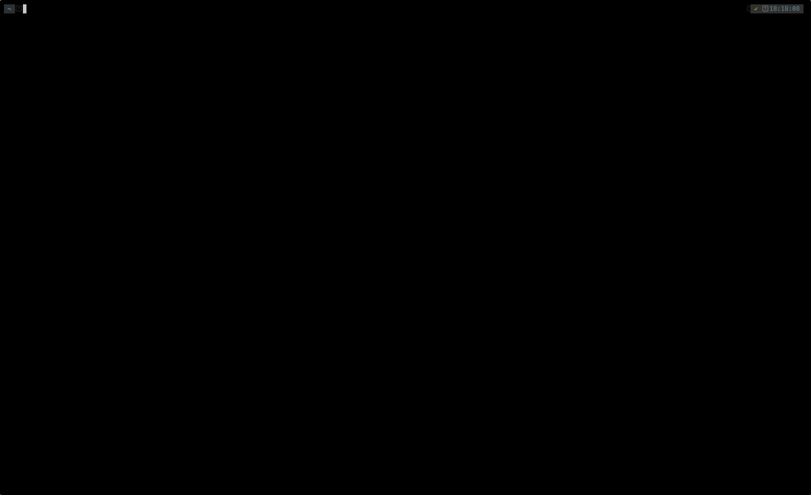

# g9s

A terminal UI for Google Cloud Platform resources.



Browse and manage Cloud Run services, Cloud Build triggers, build history,
Compute Engine VMs, and Secret Manager secrets — all without leaving the
terminal.

## Features

- **Cloud Run** — list services, view live logs, edit service YAML in `$EDITOR`
  and redeploy.
- **Cloud Build** — list triggers, run a trigger on a chosen branch.
- **Build History** — list executions, stream build logs (GCS or Cloud Logging),
  cancel in-flight builds.
- **Compute Engine** — list VMs, view live logs, delete instances.
- **Managed Instance Groups** — list zonal and regional MIGs, view their YAML.
- **Secret Manager** — list secrets, view the latest version, copy values.
- Generic `y` (YAML describe) and `c` (copy ID) bindings on every resource.
- Live filtering with `/`, command palette with `:`.
- Pagination via `PgDn`; periodic refresh that preserves your scroll position.

## Installation

### Prebuilt binaries

Download from the [latest release](https://github.com/breku/g9s/releases)
(linux/macOS/windows × amd64/arm64).

### From source

```sh
go install github.com/brekol/g9s@latest
```

Or clone and build:

```sh
git clone https://github.com/brekol/g9s.git
cd g9s
make build      # produces ./bin/g9s
```

Requires Go 1.25+.

## Authentication

g9s uses **Application Default Credentials**:

```sh
gcloud auth application-default login
```

Project selection, in order of precedence:

1. `--project` / `-p` flag
2. `G9S_PROJECT` environment variable
3. The active gcloud configuration (`~/.config/gcloud/active_config`)

## Usage

```sh
g9s                       # uses your active gcloud project
g9s --project my-project
G9S_PROJECT=my-project g9s
```

Inside g9s:

| Key       | Action                                |
|-----------|---------------------------------------|
| `:`       | Open command palette                  |
| `:cloudrun`, `:vms`, `:migs`, `:secrets`, `:triggers`, `:buildhistory` | Open a resource view |
| `/`       | Filter rows in the active view        |
| `y`       | Show YAML for the selected row        |
| `c`       | Copy the row's ID to the clipboard    |
| `PgDn`    | Load the next page                    |
| `:q`, `Ctrl-C` | Quit                             |

Resource-specific bindings (e.g. `e` to edit a Cloud Run service, `l` for logs,
`Ctrl-D` to delete a VM, `t` to run a Cloud Build trigger, `C` to cancel a
build, `v` to reveal a secret) are listed in the header hint bar.

## Configuration

CLI flags:

```
--project, -p     GCP project ID
--log-level       trace|debug|info|warn|error (default "info")
--config          config file (default $HOME/.config/g9s/config.yaml)
```

Logs are written to `$XDG_CACHE_HOME/g9s/g9s.log` (truncated each session).
Nothing goes to stderr — the TUI owns it.

## Development

```sh
make build          # build to bin/g9s
make run            # build + run
make test           # go test ./...
make lint           # golangci-lint run ./...
make tidy           # go mod tidy
make release-dry-run
```

See [AGENTS.md](./AGENTS.md) for the architecture overview, conventions, and
guidance on adding a new resource.

## License

See [LICENSE](./LICENSE).
